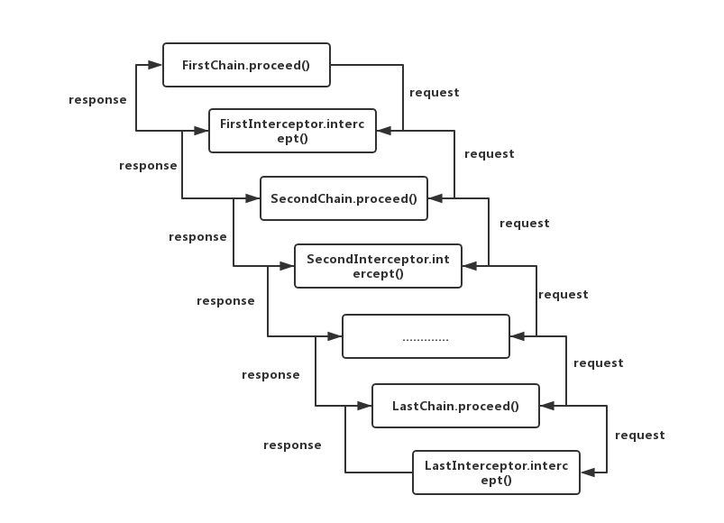

## OkHttp源码解析：基本流程

### 一、OKHttp基本介绍

okhttp官网：[http://square.github.io/okhttp/](http://square.github.io/okhttp/)

OkHttp 是一款用于 Android 和 Java 的网络请求库，也是目前 Android 中最火的一个网络库。OkHttp 有很多的优点：

- 在 HTTP/2 上允许对同一个 host 的请求共同一个 socket
- 连接池的使用减少请求延迟（如果 HTTP/2 不支持）
- 透明的 GZIP 压缩减少数据量大小
- 响应的缓存避免重复的网络请求

总之，使用okhttp可以大大提高我们的工作效率，同时保证我们网络请求框架的质量。

同时，okhttp的源码也是有非常多的地方值得我们借鉴的，在看过很多写的很优秀的开源分析的文章后，我也踏上了啃okhttp源码的坑。

*这里是我的okhttp源码分析系列文章第一篇，源码版本 `3.11.0`*

### 二、基本使用

##### 1. 创建okhttpClient

如果要简单实用okhttp，只需要创建一个okhttp的对象即可：

```
OkHttpClient client = new OkHttpClient();
```
同时okhttp也支持通过建造者模式对其进行配置：

```
 OkHttpClient client = new OkHttpClient.Builder()
                .connectTimeout(1000, TimeUnit.MILLISECONDS) // 设置连接超时时间
                .readTimeout(1000, TimeUnit.MILLISECONDS) // 设置读超时时间
                .writeTimeout(1000, TimeUnit.MILLISECONDS) // 设置写超时时间
                .addInterceptor() // 添加拦截器
                .addNetworkInterceptor() // 添加拦截器
                .authenticator() // 设置证书校验
                .build();
```

如果需要对现有的`client`的配置进行更改，可以通过  
`originalOkhttp.newBuilder()`    
获取一个新的`client`对象。通过这种方式获取的`client`是对原有`client`的一个浅拷贝，会和原有的`client`对象共用connection pool、Theads pool、以及其它的配置。

使用okhttp过程中，最好的做法是应用全局维护一个唯一的`okhttpClient`。因为每一个`okhttpClient`内部会维护一个自己的`connection pool`，线程池(thread pool)。公用`okhttpClient`可以减少不必要的线程创建，减少延迟和内存的消耗，对提高应用程序性能有比较大的帮助。

##### 2. 使用okhttp发起请求

使用okhttp发起请求的步奏：
> 1. 创建okhttpClient  
> 2. 构建request
> 3. 创建call对象，发起请求
> 4. 从response中获取请求结果

__okhttp请求方式分为`同步请求`和`异步请求`__

- 同步get请求：

```
private final OkHttpClient client = new OkHttpClient();

    public void run() throws Exception {
        Request request = new Request.Builder()
                .url("https://publicobject.com/helloworld.txt")
                .build();

        try (Response response = client.newCall(request).execute()) {
            if (!response.isSuccessful()) throw new IOException("Unexpected code " + response);

            Headers responseHeaders = response.headers();
            for (int i = 0; i < responseHeaders.size(); i++) {
                System.out.println(responseHeaders.name(i) + ": " + responseHeaders.value(i));
            }

            System.out.println(response.body().string());
        } catch (IOException e) {
            e.printStackTrace();
        }
    }
```

> 注意：由于Android不能在主线程发起请求，所以使用okhttp同步请求时应该把请求过程放在一个子线程中。
>

- 异步get请求：

```
OkHttpClient client = new OkHttpClient();
    Request request = new Request.Builder()
            .url("http://publicobject.com/helloworld.txt")
            .build();

    client.newCall(request).enqueue(new Callback() {
        @Override
        public void onFailure(Call call, IOException e) {
            e.printStackTrace();
        }

        @Override
        public void onResponse(Call call, Response response) throws IOException {
            try (ResponseBody responseBody = response.body()) {
                if (!response.isSuccessful())
                    throw new IOException("Unexpected code " + response);

                Headers responseHeaders = response.headers();
                for (int i = 0, size = responseHeaders.size(); i < size; i++) {
                    System.out.println(responseHeaders.name(i) + ": " + responseHeaders.value(i));
                }

                System.out.println(responseBody.string());
            }
        }
    });
```

> okhttp的异步请求使用的是okhttpClinet内部的线程池，其回调函数是运行在子线程中的，因而如果要在请求结果返回后有ui相关操作，应该注意线程问题。
>

- 为request添加header

```
 Request request = new Request.Builder()
                .url("https://api.github.com/repos/square/okhttp/issues")
                .header("User-Agent", "OkHttp Headers.java") // 添加header，如果对应key已存在，会覆盖原有value
                .addHeader("Accept", "application/json; q=0.5") // 添加header，已存在对应key，不会覆盖
                .addHeader("Accept", "application/vnd.github.v3+json")
                .headers(new Headers()) // 添加一组header(覆盖原有header)
                .removeHeader() // 移除所有header
                .build();
```

- 使用okhttp发起一个post请求

```
 OkHttpClient client = new OkHttpClient();

        String postBody = ""
                + "Releases\n"
                + "--------\n"
                + "\n"
                + " * _1.0_ May 6, 2013\n"
                + " * _1.1_ June 15, 2013\n"
                + " * _1.2_ August 11, 2013\n";

        RequestBody body = RequestBody.create(MediaType.parse("text/x-markdown; charset=utf-8"), postBody);

        Request request = new Request.Builder()
                .url("https://api.github.com/markdown/raw")
                .post(body)
                .build();
        client.newCall(request).enqueue(new Callback() {
            @Override
            public void onFailure(Call call, IOException e) {
                
            }

            @Override
            public void onResponse(Call call, Response response) throws IOException {
                System.out.println(response.body().string());
            }
        });
```

### 三、使用okhttp上传下载文件

- 上传文件：

```
	File file = new File("README.md");
	if (!file.exists()) {
    return;
	}
	OkHttpClient client = MyOkHttp.instance().getOkHttpClient();
	
	RequestBody body = RequestBody
	        .create(MediaType.parse("application/octet-stream"),file);
	
	Request request = new Request.Builder()
	        .post(body)
	        .url("http://www.wooyun.org")
	        .build();
	Call call = client.newCall(request);
	call.enqueue(new Callback() {
	    @Override
	    public void onFailure(Call call, IOException e) {
	
	    }
	
	    @Override
	    public void onResponse(Call call, Response response) throws IOException {
	       response.body().string());
	    }
	});
```

- 下载文件：

下载文件和正常的发送请求过程无异，无非就是返回的response的内容是一个数据流，拿到这个数据流做存储等处理而已。

### 四、监听上传下载进度

- okhttp下载进度实现

```
OkHttpClient client = new OkHttpClient();

Request request = new Request.Builder()
        .get()
        .url("http://www.wooyun.org")
        .build();
Call call = client.newCall(request);
call.enqueue(new Callback() {
    @Override
    public void onFailure(Call call, IOException e) {

    }

    @Override
    public void onResponse(Call call, Response response) throws IOException {
        if (response != null && response.body() != null) {
            long totalLength = response.body().contentLength(); // 文件总大小
            InputStream is = response.body().byteStream();

            File cache = new File("path");

            int len = -1;
            byte[] bys = new byte[1024];
            FileOutputStream fos = new FileOutputStream(cache);
            while ((len = is.read(bys)) != -1) {
                // len 为每次下载的数据大小                        
                fos.write(bys, 0, len);
            }
            fos.flush();
            fos.close();
            is.close();
        }
    }
});
```
- okhttp获取上传进度

由于okhttp并未提供上传文件的进度回调，所以我们需要自定义requestBody来实现文件上传进度的监听。

- 定义回调接口

```
public interface ProgressListener {

    /**
     * 进度回调监听
     * @param total 文件总大小
     * @param progress 当前进度
     * @param count 当前增加值
     */
    void onProgress(long total, long progress, long count);

    void onFinish();
}
```

- 自定义RequestBody

```
public class MyRequestBody extends RequestBody {

    private RequestBody mRequestBody;
    private ProgressListener mListener;

    private long totalLengh;

    public MyRequestBody(RequestBody delegate, ProgressListener listener) {
        mListener = listener;
        mRequestBody = delegate;
    }

    @Override
    public MediaType contentType() {
        return mRequestBody.contentType();
    }

    @Override
    public void writeTo(BufferedSink sink) throws IOException {
        ProgressSink progressSink = new ProgressSink(sink);
        totalLengh = contentLength();
        //将CountingSink转化为BufferedSink供writeTo()使用
        BufferedSink buffer = Okio.buffer(progressSink);
        mRequestBody.writeTo(buffer);
        buffer.flush();
    }

    @Override
    public long contentLength() throws IOException {
        try {
            return mRequestBody.contentLength();
        } catch (IOException e) {
            e.printStackTrace();
            return super.contentLength();
        }
    }

    private class ProgressSink extends ForwardingSink {

        private long progress;

        private ProgressSink(Sink delegate) {
            super(delegate);
        }

        @Override
        public void write(Buffer source, long byteCount) throws IOException {
            super.write(source, byteCount);
            progress += byteCount;
            if (progress < totalLengh) {
                mListener.onProgress(totalLengh, progress, byteCount);
            } else {
                mListener.onFinish();
            }
        }
    }
}
```

- 设置requestBody，获取上传进度监听  

```
File file = new File("path");
if (!file.exists()) {
    return;
}
OkHttpClient client = MyOkHttp.instance().getOkHttpClient();

RequestBody body = RequestBody
        .create(MediaType.parse("application/octet-stream"),file);

MyRequestBody myRequestBody = new MyRequestBody(body, new ProgressListener() {
    @Override
    public void onProgress(long total, long progress, long count) {

    }

    @Override
    public void onFinish() {

    }
});
Request request = new Request.Builder()
        .post(myRequestBody)
        .url(MyOkHttp.URL)
        .build();
Call call = client.newCall(request);
call.enqueue(new Callback() {
    @Override
    public void onFailure(Call call, IOException e) {
       
    }

    @Override
    public void onResponse(Call call, Response response) throws IOException {
       
    }
});
```

### 五、设置拦截器

拦截器是okhttp的一个核心也是一个点睛之处，okhttp大部分的核心功能都是通过拦截器来实现的。okhttp内置了几个拦截器用于处理请求前数据的处理、请求的发起以及请求后数据的处理等工作。okhttp也支持自定义拦截器，通过自定义的拦截器可以实现一些特定的功能。不过要自定义拦截器首先要做的是要了解拦截器的工作原理。

从拦截器的种类上来看主要分为这两类：

- 应用拦截器(interceptors@2x.png) ：主要负责与服务器交互前的数据处理和请求完成后的数据处理

- 网络拦截器(Network Interceptors)：主要负责和服务器的请求的建立和返回值的初步处理


**拦截器工作原理**

okhttp的拦截器使用了责任链模式来设计：通过`Interceptor.Chain`对象将整个okhttp的拦截器体系串联起来一步一步的向下执行。通过责任链模式可以控制拦截器从上到下依次执行，同时可以跳过或者重复执行中间某一个拦截器。

`通过这幅图是不是看起来清晰多了`


**如何添加拦截器**

我们在构建okhttpClient的时候可以通过OkhttpClient.Builder添加自己的拦截器：

```
 client = new OkHttpClient.Builder()
                .addInterceptor(new SelfInterceptor()) // 自定义普通拦截器
                .addNetworkInterceptor(new SelfNetworkInterceptor()) // 自定义请求过程中的拦截器
                .build();
```
### 六、使用https（自签名证书认证）

https://github.com/square/okhttp/wiki/Recipes

### 七、其他

使用压缩

实现缓存功能

MediaType解析

json解析

### 八、源码解析入门

关于源码解析，我打算从发起一个同步的网络请求入手，逐步深入。因为看源码过程中会涉及到一些设计模式和思想的运用，这些会提前熟悉一下相关的东西，过程中也会穿插学习。

1. okhttp用到的设计模式  
`建造者模式，责任链模式等`

建造者模式主要适用于一个类需要有多个地方使用，同时不同的地方可能会有不会的具体的实现过程
2. 一些网络知识（okhttp，okhttps）

(okhttp发起请求大致流程)

keep-alive

---
*参考：*

1. [okhttp wiki](https://github.com/square/okhttp/wiki/Recipes)

---